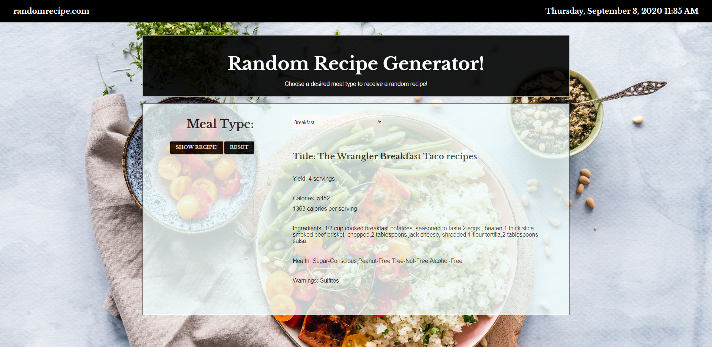

# Random Recipe Generator
  Project One: Allyse Johnson, Chase Kilpatrick, Emily Aguirre & Greg Malone.

Here is a link to the deployed website:
https://emgal-aguirre.github.io/Recipe-Generator/.

# User-Story 
I am a person who previously cooked the same dishes for years. I'd like to add variety to my diet by experimenting with meal options. When I click "Select your meal type" I am presented with options for breakfast, lunch, dinner, snack and teatime. When I select "SHOW RECIPE!", I am presented with a new dish I can try with note of its name, the required ingredients and other health factors such as calorie count, vegetarian status, allergen awareness and more. If I choose the "RESET" button, my meal type selection will reset.

Languages Used: 
1. HTML 5 
2. CSS 
3. Materialize CDN 
3. JavaScript 
5. JQuery 

APIs Used: 
1. Edamam (recipie generator) 
2. Moment.Js (live date and time)

# Here are screen shots of the website. 

